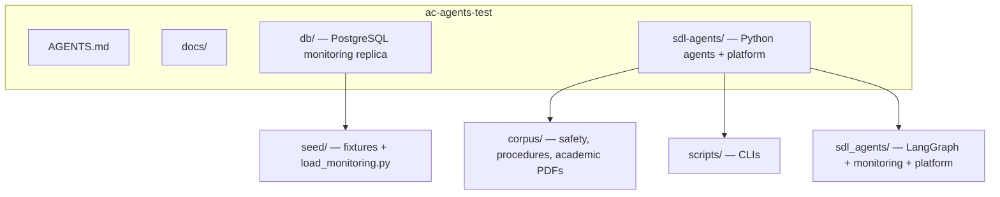
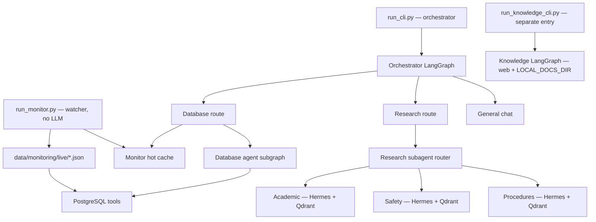
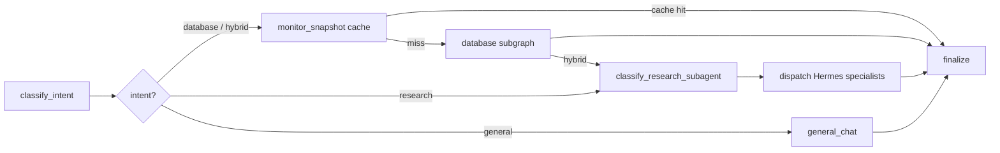
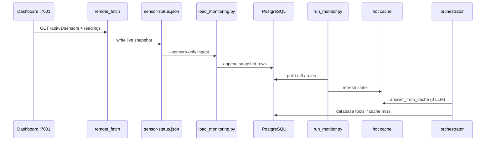
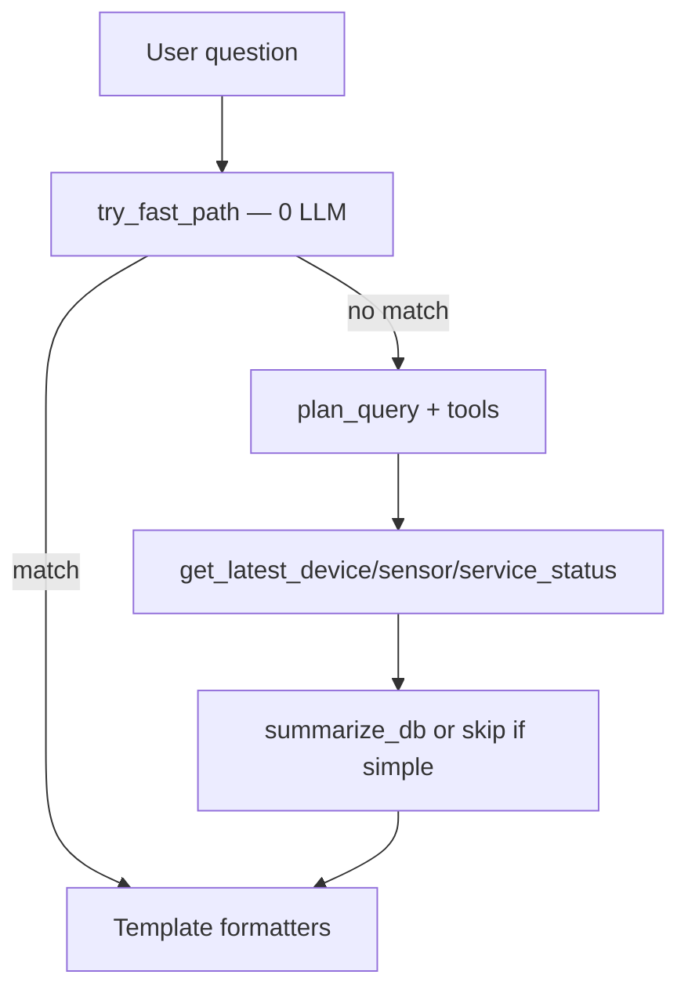
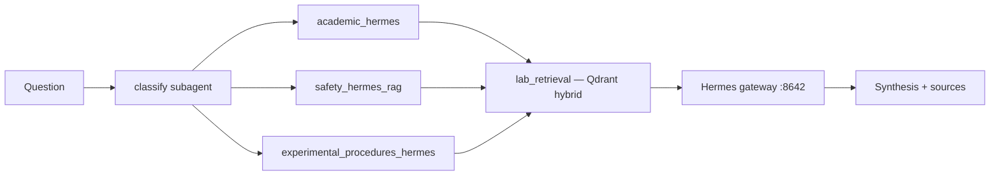

# Project overview

Multi-agent lab assistant: **live monitoring** (PostgreSQL + hot cache), **corpus research** (Hermes + Qdrant), and optional **general knowledge RAG** (web + local docs). Primary code lives in `sdl-agents/`; monitoring persistence in `db/`.

Reference: [michelle-yl/multi-agent-test](https://github.com/michelle-yl/multi-agent-test). Agent map: [AGENTS.md](../AGENTS.md).

---

## Repository layout



| Path | Role |
|------|------|
| `sdl-agents/` | Orchestrator, agents, monitoring watcher, platform (Qdrant/Mem0), tests |
| `db/` | Docker Postgres (`:5433`), schema, ingest from JSON snapshots |
| `docs/` | Ops and integration notes (this file, [remote-dashboard-7001.md](remote-dashboard-7001.md)) |
| `sdl-agents/corpus/` | Lab PDFs/MD ingested into Qdrant for research agents |

---

## Agent hierarchy



**Not routed by orchestrator:** knowledge RAG (`run_knowledge_cli.py`).

---

## Orchestrator flow

Entry: `sdl-agents/scripts/run_cli.py` → `sdl_agents/orchestrator/graph.py`.



Routing: keyword-first (`ROUTER_KEYWORD_FIRST`), then LLM (`orchestrator/router.py`). Definitional prefixes (`what is …`) default to **research** unless DB keywords match (e.g. `sensor`, `pressure`, `offline`).

---

## Monitoring pipeline

Default: **remote-only sensors** (`MONITOR_REMOTE_ONLY=1`). Live JSON under `sdl-agents/data/monitoring/live/`.



| Step | Command / module |
|------|------------------|
| Pull API | `python scripts/run_monitor.py --once --fetch-remote` |
| Ingest | `monitoring/ingest.py` → `db/seed/load_monitoring.py` |
| Background | `run_monitor.py` loop (poll + ingest; **no** auto-fetch in loop) |
| Fast answers | `monitoring/cache_answer.py`, `agents/database/fast_path.py` |

Seed JSON in `db/seed/data/monitoring/` is for **tests/fixtures** only when not using remote-only mode.

---

## Database agent

Subgraph: `sdl_agents/agents/database/graph.py`.



Tools read latest rows from Postgres. Simple patterns (offline list, yes/no online, named sensor when tokens match) avoid LLM calls when `DB_FAST_PATH_ENABLED=1`.

---

## Research agents

Sub-routes: `research_route_router.py` → one of three Hermes wrappers.



| Corpus dir | Agent |
|------------|--------|
| `corpus/academic/` | Academic literature |
| `corpus/safety/` | Safety protocols |
| `corpus/procedures/` | Experimental procedures |

Ingest: `python scripts/ingest_lab_corpora.py`. Platform: `sdl_agents/platform/` (Qdrant, BGE-M3 embeddings, optional Cognee/Mem0). Facade: `integrations/lab_retrieval.py`.

Hermes down → local corpus excerpts still returned; live gateway improves synthesis.

---

## Knowledge RAG (standalone)

`scripts/run_knowledge_cli.py` → `agents/knowledge/graph.py`.

- Indexes `SEED_URLS` + `LOCAL_DOCS_DIR` (md, txt, pdf, docx, etc.).
- Separate embeddings path from lab corpora.
- Not selected by the main orchestrator.

---

## Platform services

`docker-compose.platform.yml` in `sdl-agents/`:

| Service | Port | Use |
|---------|------|-----|
| Qdrant | 6333 | Lab corpus vectors |
| Feedback Postgres | 5432 | Optional audit/feedback |
| TimescaleDB | 5434 | Optional instrument time series |

Monitoring Postgres: `db/docker compose` on **5433** (`angie_monitoring_replica`).

---

## Configuration and CLIs

Single env file: `sdl-agents/.env` (from `.env.example`). Keys: `ANTHROPIC_API_KEY`, `HERMES_*`, `REMOTE_MONITOR_BASE_URL`, `MONITOR_*`, `ROUTER_KEYWORD_FIRST`, `DB_FAST_PATH_*`, `CAVEMAN_*`.

| CLI | Purpose |
|-----|---------|
| `scripts/run_cli.py` | Main lab orchestrator |
| `scripts/run_monitor.py` | Watcher + optional `--fetch-remote` |
| `scripts/run_knowledge_cli.py` | General doc/web RAG |
| `scripts/ingest_lab_corpora.py` | Qdrant corpus ingest |
| `scripts/fetch_remote_monitoring.py` | Pull + ingest only |

**Caveman mode** (`sdl_agents/caveman.py`): terse user-facing replies by default; routing JSON stays verbose.

---

## Tests

```bash
cd sdl-agents
pytest tests/ -v
pytest -m "not integration" -v   # no live Hermes
```

---

## Related docs

| Doc | Topic |
|-----|--------|
| [AGENTS.md](../AGENTS.md) | Agent map and fast-path commands |
| [sdl-agents/README.md](../sdl-agents/README.md) | Setup, Hermes, env table |
| [db/README.md](../db/README.md) | Postgres schema and loader |
| [remote-dashboard-7001.md](remote-dashboard-7001.md) | LAN dashboard API ingest |
